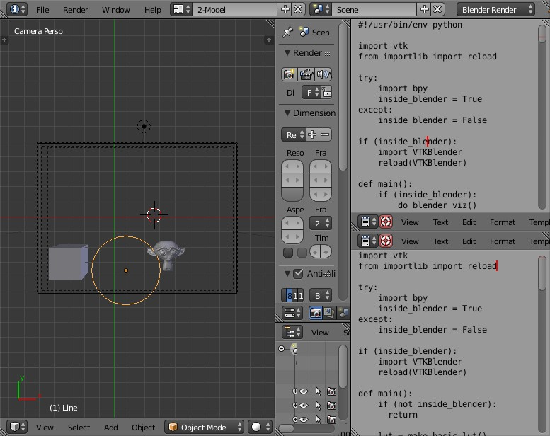
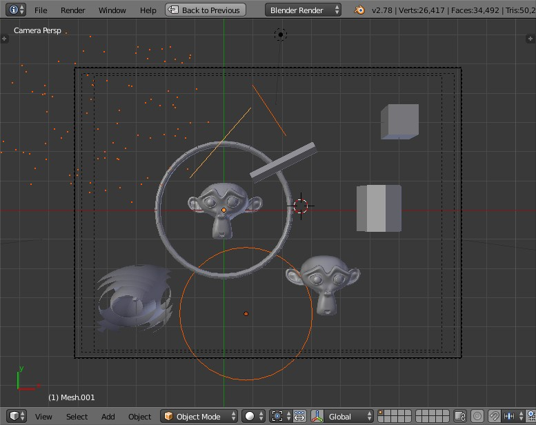
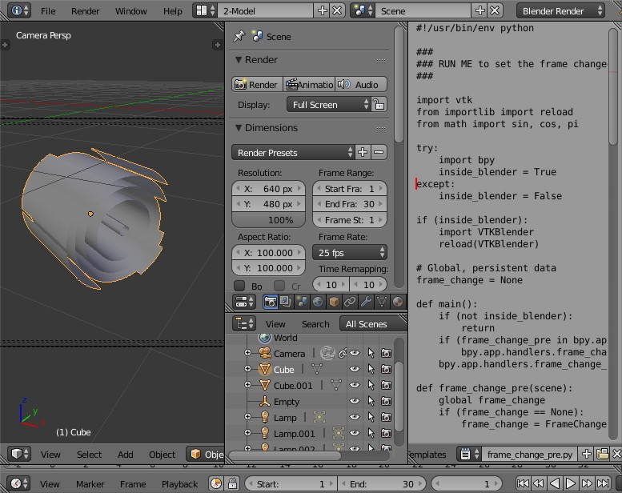
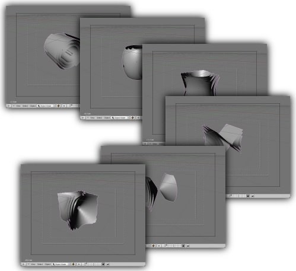
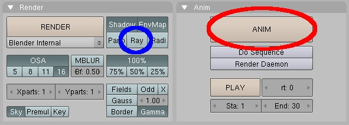

# VTKBlender: VTK and Blender

**This code has been tested with Blender 2.78 and VTK 7.1.1**

**Note that the screenshots below haven't been updated and
reflect the user interface from pre-2.5 Blender.**

## Introduction

[VTK](http://www.vtk.org/) is a great visualization library and
[Blender](http://www.blender.org/) is a fantastic rendering and animation suite.
This software uses the [python](http://www.python.org/) interpreter
inside Blender to give access to VTK routines.

It should be noted that a complete tutorial for beginners of VTK and
Blender would be a huge undertaking,
so it is recommended that the reader has some familiarity already
-- check the websites of these projects for additional documentation.

## Step 1: Get the VTKBlender Module

You can download the python module that makes this all work here: [VTKBlender.py](VTKBlender.py) (or better yet, use git to clone this repository).

Make a note of what directory you save this file in, as we will need this information in the next step.

## Step 2: Getting Blender to find the VTK libraries and the VTKBlender module

Blender's python interpreter needs to find the VTK modules and the VTKBlender 
module in order to work successfully. This is usually done via the `PYTHONPATH`
and `LD_LIBRARY_PATH` environment variables. This can be a bit finicky, so
I don't want to get into too many details, but here is what my environment
set up looks like:

```
export PYTHONPATH=/home/cwant/install/vtk/vtk-7.1.1/lib/python3.5/site-packages:/home/cwant/gitwork/VTKBlender
export LD_LIBRARY_PATH=$HOME/install/vtk/vtk-7.1.1/lib
```

The first line helps python find the VTK python packages and the VTKBlender module (this code). The second line helps the VTK python packages find the linked libraries for VTK.

## What does the VTKBlender python module do?

The VTKBlender module has two main purposes:

* To convert vtkPolyDataMapper objects to blender meshes
* To convert blender meshes to vtkPolyData objects.

There are two python classes that do these conversions. They are typically
instantiated with the following methods

* **`VTKBlender.PolyDataMapperToBlender.convert(pmapper, me=None)`**

If the function is run with only one argument, this function takes a
vtkPolyDataMapper pmapper and returns a new blender mesh with the
converted polydata. A second optional argument, which takes a pre-existing
blender mesh, may be provided, causing the existing mesh to be overwritten
with the polydata.

Please note that the new mesh (assumed to be in variable `me` below) is
not added to the scene, and can be added afterwards via:

  ```python
    ob = bpy.data.objects.new('Mesh', me)
    scn = bpy.context.scene
    scn.objects.link(ob)
  ```
  
The reason why the function takes a vtkPolyDataMapper object as an argument
(instead of a vtkPolyData object) is because the vtkPolyDataMapper can also
contain a look up table to color the data, in which case the blender
mesh will have vertex colors set accordingly.

* **`VTKBlender.BlenderToPolyData.convert(me, uvlayer=None)`**

This function take a blender mesh and returns a vtkPolyData object that
contains the geometry contained in the mesh.
If UV coordinates exist they will be exported. The name of a UV layer can
be used as an optional argument to export a particular UV layer.
The active layer will be exported if no layer is specified, so for example
if the mesh has only one UV layer, that layer will be exported without
using the optional argument.

## Examples

### Example 1

Let's test that the VTKBlender actually works by running an example file:

[VTKBlender_demo.blend](assets/VTKBlender_demo.blend)

Load this file into blender. In the main 3D window, you will see a cube,
a ring, and a monkey head. Below this you will see some buttons. On the
right part of the screen you will see two text editors with
python scripts, the top one called **vtk_to_blender.py** and the other
called **blender_to_vtk.py**.



#### Example 1a

Lets try running the top script, **vtk_to_blender.py**. The main purpose of
this script is to demonstrate how the
**VTKBlender.PolyDataMapperToBlender.convert()** function can be used to
get different kinds of geometry created with vtk into blender.
With your mouse cursor in the top script sub-window, press Alt-P to run the script, or select  "Run Python Script" from that window's file menu.

The script will create some points, some lines, a tube, a cube, a cylinder,
and the familiar quadric isosurface from the VTK examples.
Notice how the cube actually turns into the quadric isosurfaces: this is an
example of **VTKBlender.PolyDataMapperToBlender.convert()** being passed the
cube mesh as an argument, thus overwriting the cube's mesh.


The other thing that is of interest with this script is that it has some code
to detect whether it is running inside of blender or not, and if it
determines that it is not running inside blender, it will call the VTK library
to render the objects created. In the script window's File menu, select save
to write the script to an external text file and try it for yourself!

#### Example 1b

The next example shows interaction between VTK and Blender in the opposite
direction: geometry created in blender (the monkey head) will be passed to
VTK, run through a probe filter to color it (using the quadric scalar field)
and returned to the blender scene as a new object. At the same time,
the ring object will be passed to VTK, run through a tube filter, and
returned to blender. Place your mouse cursor
in the bottom text window and press Alt-P to run the script.



Where are the colors? Lets switch to shaded mode to see them
(press Shift-Z with your mouse cursor in the 3D window to
switch display modes).


We can then render this scene with blender's scanline renderer to produce the following image:


Hmmm, that doesn't look like a particularly impressive render! Blender has
a built in scanline render and a build in raytracer, and has support
to use the external YAFRay raytracer. In the right hands, Blender can
make some very impressive images, of which the above image is not. We'll
do something a bit more fancy in the next example, but in the meantime,
check out the Blender website gallery archive to see why Blender is an
excellent choice for 3D Graphics:

http://archive.blender.org/features-gallery/gallery/

### Example 2

In this example we will use Blender to animate and render a visualization
created in VTK. (Please note that some of the screenshots are out of date.)

Download the example file here:

[VTKBlender_demo2.blend](assets/VTKBlender_demo2.blend)



The thing that drives the animation is a callback that runs some code
via a handler: ```bpy.app.handlers.frame_change_pre```.
The handler tells Blender that we would like the script
```frame_change_pre.py``` to be executed every time the frame changes.
To see this effect, run the script in Blender, then change the frame
using the left or right arrow keys or watch the scene being
animated by pressing Alt-A when the mouse pointer is in the 3D window.



The script ```frame_change_pre.py``` creates the VTK pipeline the first
time it is run, creating some isosurfaces in a field
generated from a vtkQuadric object. On subsequent invocations the parameters
of the quadric filter are modified based on the frame number, and new
isosurfaces are created. The object that does this work is stored as a
global variable so that we don't have to constantly recreate our pipeline.

We can use the scanline renderer to render individual frames, or we can
create a 30 frame animation by pressing the Anim button.


OK, do you remember in the last example when I said we would be doing
something more fancy? Well, here it is: press the 2 key with your mouse
pointer in the 3D Window to reveal the hidden layer number 2, enable the
raytracer with the Ray button, and press Anim.



We are going to be raytracing so I hope you have a lot of spare CPU time!
If you wait long enough, the final result will look something like this
(click to download an mpeg of the animation, let the animation
loop in your viewer):

[](assets/blender-vtk.mpg)

That should be enough to get people started using VTK and Blender together.
To get full use of VTK and Blender,
refer to the corresponding websites to download or purchase additional
documentation:

* http://www.vtk.org
* http://www.blender.org

Have fun!

## Notes
* **2017-04-29**: First beta of the version for Blender 2.7x released.
* **2017-04-17**: Moved this code to GitHub
* **2008-07-03**: Jon Crall from Kitware requested access to UV coordinates so that he could use the models from
  [Big Buck Bunny](http://www.bigbuckbunny.org/) in VTK. The function BlenderToPolyData() now will export UV coords
  if they exist, and has an optional argument to specify the UV layer (the active layer will be used if no argument
  is supplied). The code, examples, and documentation have also been updated to reflect the new Blender API syntax for linking objects to scenes: scene.link(object) is now supposed to be scene.objects.link(object).
* **2006-08-23**: Some bugfixes and speedups -- thanks to Fritz Mielert from the University of Stuttgart for his valuable
  feedback!
* **2006-07-11**: The VTKBlender.py module and the demos have been updated for VTK 5.x and for Blender 2.41 and later.
  These new versions no longer uses the Blender 'NMesh' module to manupulate meshes, and instead uses the new 'Mesh'
  module for faster access.
